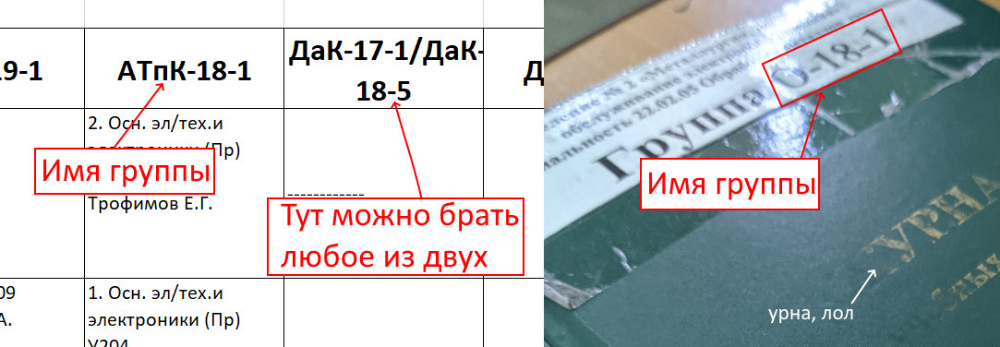

# Расписание для группы

## Команда

Команду `расписание` можно сократить до `расп` или использовать синоним `timetable`

## Аргументы

Команда принимает 3 аргумента:

### 1. Дата

Смотрите [аргумент даты](../info/howtouse.md#аргумент-даты)

### 2. Группа

Название группы должно быть в формате `XXX-XX-X`, например `ИсПК-18-2`. Правильное написание группы можно посмотреть в файле замен на портале или на обложке журнала. Если ваша группа имеет два названия, то можно писать любое из них. Регистр игнорируется.


### 3. Подгруппа

Номер подгруппы для которой необходимо вывести расписание

- Для первой подгруппы можно написать `1`, `первая`, `перв` или `один`
- Для второй подгруппы можно написать `2`, `вторая`, `втор` или `два`

## Результат

В ответ на запрос команда возвращает список пар на конкретную дату (см. [Условные обозначения](../info/howtouse#условные-обозначения))

### Причины выдаваемых ошибок:

- Отсутствуют замены на эту дату на портале (см. [Как устроен бот](../info/howitworks.md))
- Указана несуществующая группа

## Примеры

```
Вы: Расписание
Бот: Укажите дату
Вы: Завтра
Бот: Укажите группу
Вы: Испк-18-2
Бот: Укажите подгруппу
Вы: Первая
Бот: Расписание для группы ИСпК-18-2 первой подгруппы на среду 18.03.2020...
```

```
Вы: расп сегодня испк-18-2 1
Бот: Расписание для группы ИСпК-18-2 первой подгруппы на среду 18.03.2020...
```
