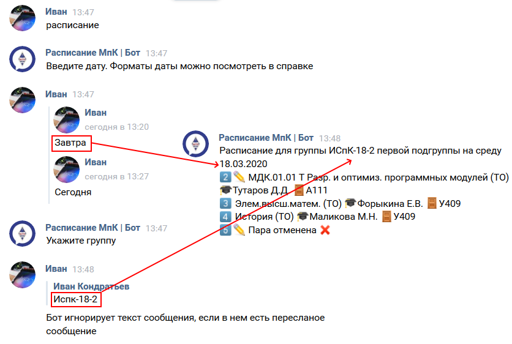

# Как пользоваться ботом?

На данныый момент боту можно написать в [ВК](https://vk.com/mpkbot).

## Обработка комманд Бот может воспринимать команды в двух режимах:

1. **Режим диалога.** Вы пишите просто команду без аргументов или нажимаете нужную вам кнопку, а затем отвечаете на вопросы бота. После отправки ответа бот его сразу проверяет на ошибки и переходит к следующему вопросу. После ответа на все вопросы выводиться результат

Что бы выйти из диалоога необходимо написать `отмена`

**Пример:**

```properties
Вы: Расписание
Бот: Введите дату
Вы: Завтра
Бот: Укажите группу
Вы: 12-1
Бот: ❌Группа указана неверно.
Вы: Испк-18-2
Бот: Укажите подгруппу
Вы: Первая
Бот: Расписание для группы ИСпК-18-2 первой подгруппы...
```

2. **Всё в одной строке.** Вы пишите комманду и её аргументы через пробел в одном сообщении и если в них нет ошибок, то выводиться результат.

**Пример:**

```properties
Вы: Расписание завтра испк-18-2 1
Бот: Расписание для группы ИСпК-18-2 первой подгруппы...
Вы: Расписание завтра испк 1
Бот: ❌Группа указана неверно
```

Оба способа работают для всех комманд

## <a name="wegend"></a>Аргумент даты

Для указания конкретного дня можно использовать следующие форматы:

- `Позавчера`, `Вчера`, `сегодня`, `завтра`, `послезавтра`
- `ДД.ММ`, например `01.03`
- `ДД.ММ.ГГ`, например `01.02.20`
- `ДД.ММ.ГГГГ`, например `01.02.2020`
- `Понедельник`, `Вторник`, ... `Суббота`
- `Пн`, `Вт`, ... `Сб`

Что бы вывести данные за все доступные дни можно воспользоваться словаом `все` или `all`

## <a name="legend"></a>Условные обозначения

В выводоваемом расписаннии присутсвуют некоторые символы emoji. Их значения:

- 2⃣ - Номер пары
- ✏ - Пара из замен
- ❓ - Во время обработи замены произошла ошибка. В ответ просто скопировано содержимое ячейки файла замен
- 🎓- ФИО прподавателя
- 🚪 - Номер кабинета

## Сокращения и синонимы комманд

Почти каждую комманду можно написать сокращенно или на английсокм. Например `расписание` можно сократить до `расп` или использовать его синоним - `timetable`. О сокращинии конкретной комманды смотрите на странице коммпанды

## Пересланые сообшения

Если переслать сообщение, то бот будет обрабатывать текст из пересланого сообщения. Если пересалать несколько сообщеней, то бот возмет текст только из первого сообщения

